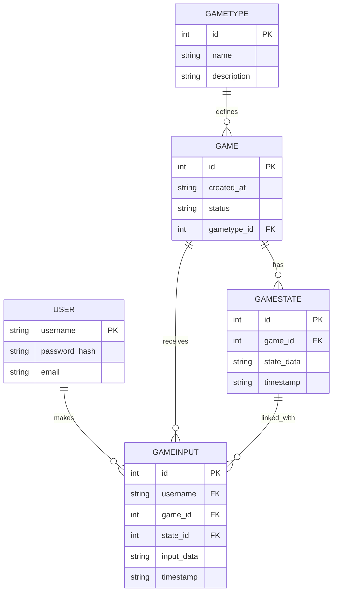
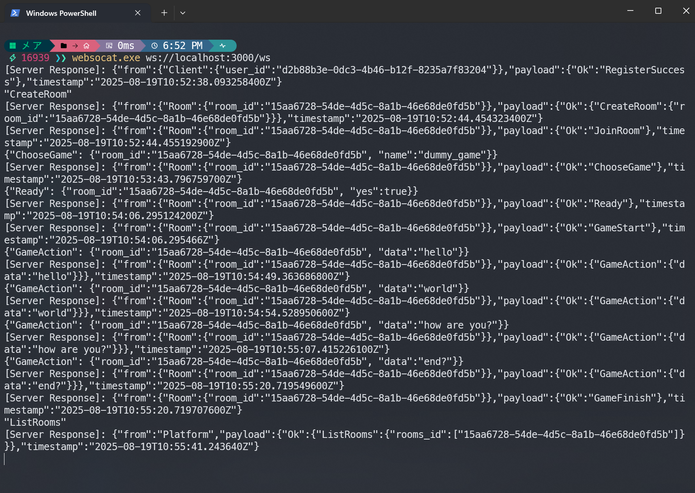
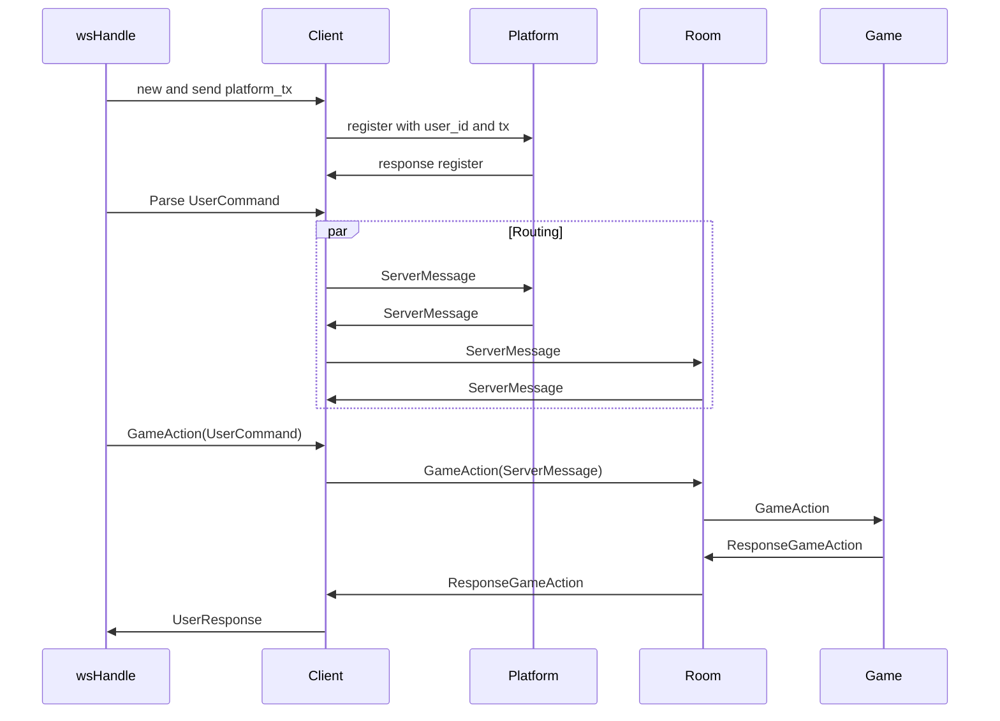

## 简介

本项目是一个以 agent 博弈为目标的异步游戏/平台服务框架。
目前仍处于非常早期阶段，仅实现了少量基础功能。API 与文档仍在频繁演进中，接口可能随时发生较大变动。

本项目目标是提供一个可扩展的服务端框架，支持：

- 多场并发 game 实例（不同类型、不同用户同时参与）
- 基于 WebSocket 的异步通信（可自定义客户端接入）
- 将 Platform、Room、Game 三层进行职责分离，便于扩展自定义游戏逻辑与自动化 agent 客户端接入
- 提供在服务器端的 agent 输入与 game 状态存储

## Database

## Test
提供简易测试, 默认运行在3000端口. "dummy_game"会在第四次输入时结束游戏并告知room和player.

## Overview

This project is an asynchronous platform/framework for agent-based game competitions.
The project is in a very early stage. Only a minimal subset of features has been implemented and both the API and documentation are still unstable and subject to change.

## The main goals:

- Support many concurrent game instances (different types; users may join multiple games concurrently)
- Use WebSocket for asynchronous communication and allow custom clients to connect
- Clean separation of Platform / Room / Game responsibilities for extensibility and easy integration of automated clients or custom game logic

## Current Status

- PoC stage: basic message routing and minimal game lifecycle control complemented
- API and documentation are incomplete and may introduce breaking changes
- Missing features: registration/login, auth, persistence, official clients, monitoring UI

## Arch

## Explanation:

- wsHandle: low-level WS handler (read/write sockets, (de)serialization)
- Client: logical session representing a connected client
- Platform: platform layer for routing, user/session management, cross-room coordination
- Room: room / logical unit responsible for matching, room-scoped strategy and state; can be a logical sub-layer of Platform
- Game: individual game instance executing game logic

The par Routing block shows that after parsing, messages may be routed concurrently to multiple targets (broadcast or multiple recipients).

## Design Notes

- Room as Platform logic layer: Rooms don’t necessarily own network sockets; they live inside Platform as logical units to simplify responsibilities.
- No enforced per-user concurrency limits: Users can participate in many games at once unless a policy enforces limits.
- Protocol-based extensibility: As long as clients adhere to the message formats, they can integrate; official clients are planned to ease integration.

## Roadmap

### Short-term:

- User registration / login
- Input authentication (token/session)
- Basic persistence (logs, replays)

### Mid-term:

- Official clients (for automated agents / manual users)
- Server monitoring UI

### Long-term:

- Plugin-style game integration API
- Clustered/high-availability deployment