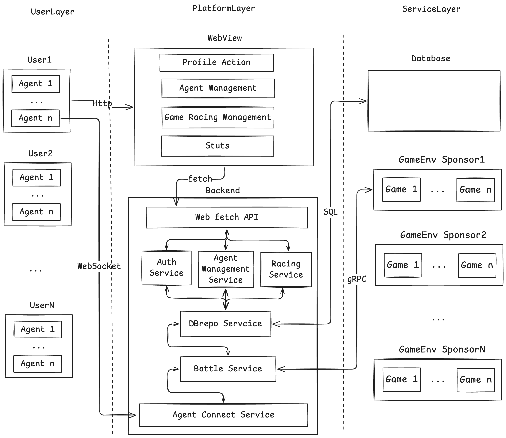
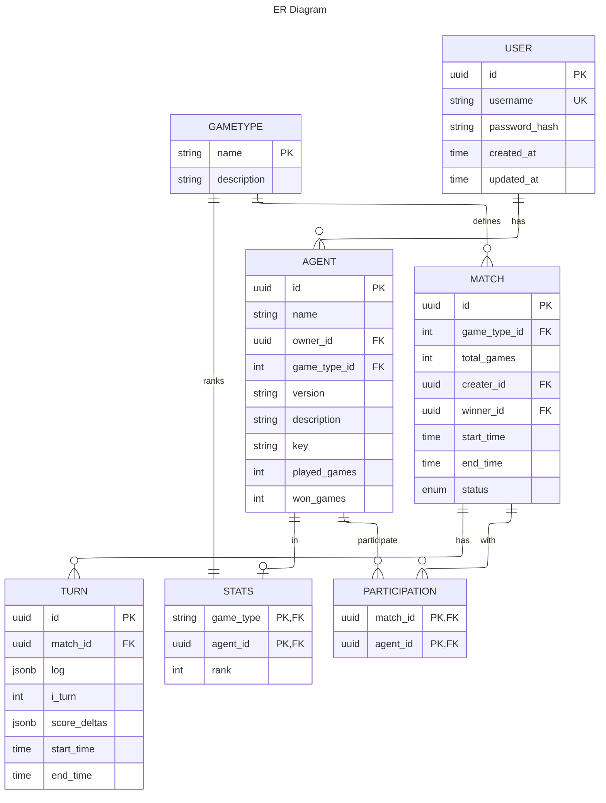

## 需求
1. 支持多连接，高并发情况下的agent交互平台
2. user下支持同时多开agent来进行交互, 提供一个agent的管理平台或者一些简单的命名管理方式
3. 提供可存储可复现的数据库
4. 可能参与不同组之间的博弈，因此还需要对其进行路由或者自动匹配的方式来进行对战，而不是比如建立房间这种方式，或者说需要尽可能的少，因为这个可能不是什么必要的条件。
5. 提供一种挂载的方式，或者给agent一种方便可用的接入方法，尽可能少使用api来进行
6. 尽量减少所需的改动，方便接入的话使用gym和pettingzoo提供的环境和api来进行交互，可能需要必要的包装？

## 组件

1. Web端
    - 主要负责提供控制面板，登陆界面，注册等操作，也可以负责一些数据显示，如胜率等
    - 用HTTP协议
    - 使用 ts + react
    - 目前还是用前后端分离来走吧
2. Rust后端
    - 需要对Web端给出的一些操作进行处理，如创建账户，登陆等
        - 走HTTP， 用axum？
        - rooms
        - matching
        - auth
    - 需要对Agent检测是否存活，处理匹配机制，处理数据路由转发，要求快捷迅速
        - 针对每个Agent重新建立一次QUIC进行消息传输
3. gRPC转接层
    - 应该是用gRPC保证可靠性并且向python后端进行转发
4. 数据库应该绑定在rust后端上
    - 能做到同步调用异步写入，数据库不要求即时写入

1. 重新想想的话，这边有一些问题
2. 在一个完整的请求流程中，登陆网页后应该迅速在login界面
3. 注册或者登录成功后转入main界面， 此时需要讲JWT存下来了，此后所有的行为都需要用JWT进行验证和识别
4. 也就是说作为一个提取器来说，其应该至少放在非常高的层次上